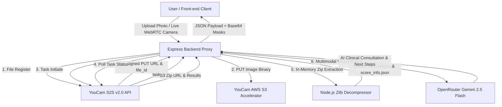

# ⚡ SkinPulse AI — Clinical Dermatological Diagnostic Platform

> **YouCam AI Skin AI Hackathon Edition**  
> Powered by **YouCam S2S v2.0 REST API** & **OpenRouter Gemini 2.5 Flash Multimodal AI Vision**

[](https://reactjs.org/)
[](https://vitejs.dev/)
[](https://nodejs.org/)
[](https://expressjs.com/)
[](https://yce.makeupar.com/)
[](https://openrouter.ai/)
[](https://tailwindcss.com/)

---

## 🌟 Overview

**SkinPulse AI** is an advanced, production-grade dermatological web application built for the **YouCam API Skin AI Hackathon**. It combines Perfect Corp's official **YouCam S2S v2.0 AI Engine** with **Google Gemini 2.5/1.5 Flash Multimodal Vision** to perform real-time facial skin diagnostics, extract high-resolution mask overlays, and deliver actionable clinical skincare consultations.

---

## 🔥 Key Features

- **📡 4-Step Official YouCam S2S v2.0 AI Pipeline:**
  - **Step 1 (`POST /s2s/v2.0/file/skin-analysis`):** Registers uploaded facial images and acquires pre-signed AWS S3 upload URLs & `file_id`.
  - **Step 2 (`PUT` to S3):** Uploads raw image binary buffers directly to YouCam's AWS S3 bucket.
  - **Step 3 (`POST /s2s/v2.0/task/skin-analysis`):** Initiates the AI analysis task specifying target diagnostic actions (`acne`, `wrinkle`, `texture`, `moisture`, `oiliness`, `pore`, `redness`).
  - **Step 4 (`GET /s2s/v2.0/task/skin-analysis/{task_id}`):** Polls YouCam's task status until real-time AI results are returned.

- **📦 In-Memory YouCam S3 Zip Mask Extractor:**
  - Automatically fetches and decompresses YouCam's output `.zip` package in memory without disk I/O.
  - Parses `score_info.json` for exact `ui_score` & `raw_score` metrics.
  - Extracts authentic high-resolution PNG mask overlays (`acne_output.png`, `wrinkle_output.png`, `texture_output.png`, `oiliness_output.png`, `moisture_output.png`, `pore_output.png`, `redness_output.png`) and converts them to base64 Data URLs for real-time layering.

- **🤖 Multimodal Gemini 2.5 Flash Clinical Consultation:**
  - Queries **Google Gemini 2.5/1.5 Flash** via OpenRouter by passing both the user's facial image and YouCam diagnostic metrics.
  - Generates:
    - **Clinical Diagnosis Summary:** A 3-sentence expert skin health overview.
    - **Multimodal Vision Findings:** Visual observations identified directly on the facial photo.
    - **What To Do Next (Step-by-Step Action Plan):** Prioritized daily skincare instructions.
    - **Ingredients & Habits To Avoid:** Highlights harmful skincare ingredients and practices.

- **📊 Interactive Visual Diagnostic Dashboard:**
  - Circular overall skin vitality score gauge (0–100) with dynamic HSL color themes.
  - Interactive parameter mask preview cards gallery with full-screen zoom modal.
  - Blemish hotspot radar heatmap overlay.
  - Tailored AM/PM skincare routine engine & active ingredient match.

- **📄 Export & Download Capabilities:**
  - **Direct YouCam Zip Download:** One-click download button for YouCam's official S3 `.zip` analysis package.
  - **PDF Clinical Report Export:** Export a formatted, high-resolution diagnostic PDF report.

---

## 🏗️ System Architecture



---

## 🚀 Getting Started

### Prerequisites
- **Node.js**: `v18.0.0` or higher
- **npm**: `v9.0.0` or higher
- **YouCam API Key**: Perfect Corp YCE Developer Portal Key
- **OpenRouter API Key**: (Optional) For Gemini 2.5 Flash AI Consultations

### Installation

1. **Clone the Repository:**
   ```bash
   git clone https://github.com/Likhith2007/youcam.git
   cd youcam
   ```

2. **Install Dependencies:**
   ```bash
   npm install
   ```

3. **Configure Environment Variables:**
   Copy `.env.example` to `.env` and insert your API keys:
   ```bash
   cp .env.example .env
   ```

   Edit `.env`:
   ```env
   YOUCAM_API_KEY=your_youcam_api_key_here
   YOUCAM_API_ENDPOINT=https://yce-api-01.makeupar.com/s2s/v2.0/file/skin-analysis
   OPENROUTER_API_KEY=your_openrouter_api_key_here
   OPENROUTER_MODEL=google/gemini-2.5-flash
   PORT=3001
   ```

4. **Run Local Development Server:**
   ```bash
   npm run dev
   ```
   *This starts both the Express backend server (port `3001` with `--watch`) and Vite frontend dev server (`http://localhost:5173`).*

---

## 🛠️ API Reference

### `POST /api/analyze-skin`
Accepts `multipart/form-data` image upload (`image`) or JSON payload with `imageBase64`.

**Response Example:**
```json
{
  "isSimulated": false,
  "apiStatus": "youcam_realtime_ai",
  "fileId": "nB6QQMZ8s9jASUJjNVa7SkbS...",
  "taskId": "4XTBx28nNadiAS86O...",
  "reportZipUrl": "https://yce-us.s3-accelerate.amazonaws.com/...",
  "overallScore": 88,
  "skinAge": 22,
  "skinType": "Balanced / Combination",
  "masks": {
    "acne": "data:image/png;base64,...",
    "wrinkle": "data:image/png;base64,...",
    "oiliness": "data:image/png;base64,...",
    "moisture": "data:image/png;base64,...",
    "texture": "data:image/png;base64,...",
    "pore": "data:image/png;base64,...",
    "redness": "data:image/png;base64,..."
  },
  "geminiConsultation": {
    "summary": "Clinical diagnostic overview...",
    "visualObservations": ["Observation 1", "Observation 2"],
    "nextSteps": ["Step 1: Immediate action", "Step 2: Barrier repair"],
    "ingredientsToAvoid": ["Harsh scrubs", "High alcohol toners"]
  }
}
```

---

## 💻 Tech Stack

- **Frontend:** React 18, Vite 6, Tailwind CSS, Lucide React, Framer Motion, HTML2Canvas, jsPDF, Canvas Confetti
- **Backend:** Node.js, Express, Multer, Cors, Dotenv, Native Zlib Zip Decompressor
- **Integrations:** Perfect Corp YouCam S2S v2.0 REST API, OpenRouter Gemini 2.5/1.5 Flash LLM

---

## 🛡️ License & Acknowledgments

Built for the **YouCam API Skin AI Hackathon** &copy; 2026 **SkinPulse AI**.  
Powered by **Perfect Corp YouCam AI Technology** & **Google DeepMind / OpenRouter Gemini AI**.
